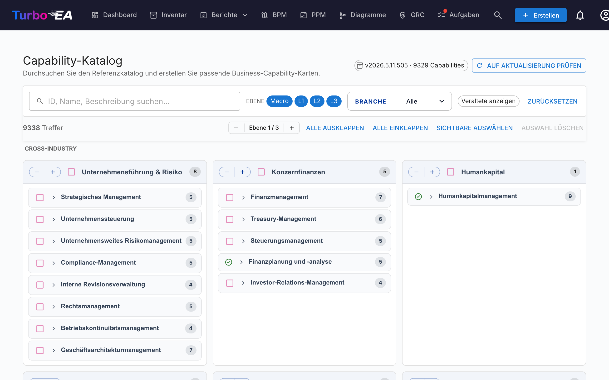

# Capability-Katalog

Turbo EA wird mit dem **[Business Capability Reference Catalogue](https://catalog.turbo-ea.org)** ausgeliefert — einem kuratierten, offenen Katalog von Geschäftsfähigkeiten, gepflegt unter [github.com/vincentmakes/turbo-ea-capabilities](https://github.com/vincentmakes/turbo-ea-capabilities). Auf der Capability-Katalog-Seite können Sie diese Referenz durchsuchen und passende `BusinessCapability`-Karten in einem Schritt erzeugen, statt sie einzeln einzugeben.

## Seite öffnen

Klicken Sie oben rechts auf das Benutzersymbol und dann auf **Capability-Katalog**. Die Seite ist für alle Nutzer mit der Berechtigung `inventory.view` verfügbar.

## Was Sie sehen

- **Kopfzeile** — die aktive Katalogversion, die Anzahl der enthaltenen Capabilities und (für Administratoren) Steuerelemente zum Prüfen und Laden von Updates.
- **Filterleiste** — Volltextsuche über ID, Name, Beschreibung und Aliase, plus Level-Chips (Macro → L1 → L4), Branchen-Mehrfachauswahl und ein „Veraltete anzeigen“-Schalter. Bleibt beim Scrollen direkt unter der oberen Navigation angeheftet.
- **Aktionsleiste** — Treffer-Zähler, der globale Level-Stepper (alle L1s gemeinsam Ebene für Ebene auf-/zuklappen), Alle ein-/ausklappen, Sichtbare auswählen, Auswahl löschen. Bleibt zusammen mit der Filterleiste angeheftet, sodass die Steuerelemente auch tief im L1-Teilbaum erreichbar bleiben.
- **L1-Raster** — eine Karte je Top-Level-Capability, **gruppiert unter Branchenüberschriften**. **Cross-Industry**-Capabilities stehen ganz oben; weitere Branchen folgen alphabetisch; Capabilities ohne Branchenangabe landen am Ende in einem **Allgemein**-Block. Der L1-Name liegt in einem hellblauen Header-Streifen; untergeordnete Capabilities erscheinen darunter, eingerückt mit einer feinen senkrechten Linie zur Tiefenanzeige — dasselbe Hierarchie-Muster wie an anderen Stellen der App, damit die Seite kein eigenes visuelles Profil entwickelt. Lange Namen werden auf mehrere Zeilen umbrochen, statt abgeschnitten zu werden. Jeder L1-Header hat zudem seinen eigenen `−` / `+`-Stepper: `+` öffnet die nächste Ebene innerhalb dieses einen L1, `−` schließt die jeweils tiefste offene Ebene. Beide Schaltflächen sind immer sichtbar (die nicht verfügbare Richtung ist deaktiviert), die Aktion gilt nur für diesen einen L1 — andere Zweige bleiben unverändert — und der globale Level-Stepper am Seitenkopf wird nicht beeinflusst.
- **Nach-oben-Schaltfläche** — sobald Sie über die Kopfzeile hinaus scrollen, erscheint unten rechts ein runder schwebender Pfeil. Ein Klick gleitet sanft an den Seitenanfang zurück. Die Schaltfläche rückt automatisch nach oben, wenn die **N Capabilities erstellen**-Sticky-Leiste aktiv ist, damit sich die beiden nie überlappen.

## Capabilities auswählen

Aktivieren Sie das Kontrollkästchen neben einer Capability, um sie der Auswahl hinzuzufügen. Die Auswahl kaskadiert in beide Richtungen den Teilbaum hinunter, berührt aber nie Vorfahren:

- **Aktivieren** einer nicht ausgewählten Capability fügt sie und jeden auswählbaren Nachfolger hinzu.
- **Deaktivieren** einer ausgewählten Capability entfernt sie und jeden auswählbaren Nachfolger.

Das Deaktivieren eines einzelnen Kindes entfernt also nur dieses Kind und alles darunter — der Elternknoten und seine Geschwister bleiben ausgewählt. Das Deaktivieren eines Elternknotens entfernt den gesamten Teilbaum in einer Aktion. Um eine „L1 + ein paar Blätter“-Auswahl zusammenzustellen, wählen Sie das L1 (das den ganzen Teilbaum aktiviert) und deaktivieren anschließend die L2/L3-Capabilities, die Sie nicht möchten — das L1 bleibt aktiviert und sein Kontrollkästchen bleibt gesetzt.

Die Seite übernimmt automatisch das app-weite Hell-/Dunkelschema — der Dunkelmodus zeigt dasselbe neutrale Layout auf `#1e1e1e`-Papier mit lavendelfarbenem Text und Akzenten.

Capabilities, die in Ihrem Inventar **bereits existieren**, erscheinen mit einem **grünen Häkchen-Symbol** anstelle eines Kontrollkästchens. Sie können nicht ausgewählt werden — Sie erzeugen über den Katalog nie zweimal dieselbe Business Capability. Beim Abgleich wird zuerst der `attributes.catalogueId`-Stempel eines vorherigen Imports geprüft (so überlebt das grüne Häkchen Namensänderungen), und es wird auf einen Vergleich des Anzeigenamens (Groß-/Kleinschreibung-unabhängig) zurückgegriffen, falls Sie die Karte von Hand erstellt haben.

## Massenanlage von Karten

Sobald mindestens eine Capability ausgewählt ist, erscheint am Seitenende eine fixe Schaltfläche **N Capabilities erstellen**. Sie nutzt die normale `inventory.create`-Berechtigung — wenn Ihre Rolle keine Karten anlegen darf, ist die Schaltfläche deaktiviert.

Bei Bestätigung führt Turbo EA Folgendes aus:

- Erstellt je eine `BusinessCapability`-Karte pro ausgewähltem Katalogeintrag.
- **Behält die Kataloghierarchie** automatisch — wenn sowohl der Eltern- als auch der Kindknoten ausgewählt ist (oder der Elternknoten lokal bereits existiert), wird `parent_id` der neuen Kindkarte korrekt verdrahtet.
- **Überspringt vorhandene Treffer** stillschweigend. Der Ergebnisdialog zeigt, wie viele Karten erstellt und wie viele übersprungen wurden.
- Stempelt jede neue Karte in `attributes` mit `catalogueId`, `catalogueVersion`, `catalogueImportedAt` und `capabilityLevel`, sodass die Herkunft nachvollziehbar bleibt.

Den gleichen Import erneut auszuführen ist sicher — er ist idempotent.

**Bidirektionale Verknüpfung.** Die Hierarchie wird in beide Richtungen ergänzt, die Reihenfolge des Imports spielt also keine Rolle:

- Wird nur ein Kind ausgewählt, dessen Katalog-**Elternknoten bereits als Karte existiert**, wird das neue Kind automatisch unter diesem Elternknoten eingehängt.
- Wird nur ein Elternknoten ausgewählt, dessen Katalog-**Kinder bereits als Karten existieren**, werden diese Kinder unter die neue Karte umgehängt — unabhängig davon, wo sie zuvor lagen (auf oberster Ebene oder von Hand unter eine andere Karte gehängt). Beim Import gilt der Katalog als Quelle der Wahrheit für die Hierarchie; wenn Sie für eine bestimmte Karte einen anderen Elternknoten wünschen, bearbeiten Sie sie nach dem Import. Der Ergebnisdialog meldet die Anzahl der neu verknüpften Karten zusätzlich zu den erstellten und übersprungenen Zählungen.

## Macro-Capabilities (Level 0)

Über den Ebenen L1 / L2 / L3 / L4 liefert der Katalog eine zusätzliche **Macro**-Ebene aus — eine kleine Gruppe geschäftsorientierter Bündel, die ganze L1-Familien klammern. Beispiele sind *Customer Engagement* (klammert Sales-, Marketing-, Service-L1s) oder *Talent & Workforce* (klammert HR-L1s).

Macros sind erstklassige Katalog-Einträge:

- Sie landen im Inventar als `BusinessCapability`-Karten mit `attributes.capabilityLevel = "Macro"` und einer `catalogueId` mit dem Präfix `MC-` (z.B. `MC-10`).
- Sie sitzen **über** ihren L1-Kindern — das Hierarchie-Tiefenlimit lockert sich von 5 auf 6, um die zusätzliche Ebene aufzunehmen (`Macro → L1 → L2 → L3 → L4 → L5`).
- Beim Import eines Macros werden alle existierenden L1-Kinder, die als zu diesem Macro gehörig markiert sind, automatisch unter die neue Karte gehängt — dieselbe bidirektionale Verlinkung wie zwischen L1 und niedrigeren Ebenen.
- **Macros matchen nie auf bestehende Karten nach Namen** — nur nach `catalogueId`. Dies vermeidet versehentliche Kollisionen mit kundenseitig benannten Capability-Gruppen, die zufällig denselben Namen wie ein Katalog-Macro tragen.

Macros sind aus der Katalogseite genauso auswählbar wie L1s — die Checkbox setzen und der Teilbaum wird entsprechend ausgewählt.

## Detailansicht

Klicken Sie auf den Namen einer Capability, um einen Detail-Dialog zu öffnen, der Brotkrümelpfad, Beschreibung, Branche, Aliase, Referenzen und eine vollständig ausgeklappte Sicht des Teilbaums anzeigt. Vorhandene Treffer im Teilbaum werden mit einem grünen Häkchen markiert.

## Katalog aktualisieren (Administratoren)

Der Katalog wird **mitgeliefert** als Python-Abhängigkeit, sodass die Seite offline / in Air-Gap-Umgebungen funktioniert. Administratoren (`admin.metamodel`) können bei Bedarf eine neuere Version laden:

1. Klicken Sie auf **Auf Update prüfen**. Turbo EA fragt die PyPI-JSON-API unter `https://pypi.org/pypi/turbo-ea-capabilities/json` ab und meldet, ob eine neuere veröffentlichte Version verfügbar ist. PyPI ist die maßgebliche Quelle zum Zeitpunkt der Veröffentlichung, sodass ein vor wenigen Minuten freigegebenes Wheel sofort erkannt wird.
2. Falls ja, klicken Sie auf die erscheinende Schaltfläche **v… abrufen**. Turbo EA lädt das aktuelle Wheel von PyPI herunter, extrahiert die Katalog-Daten daraus und speichert sie als serverseitigen Override; er wirkt sofort für alle Nutzer.

Die aktive Katalogversion wird stets im Header-Chip angezeigt. Der Override wird nur dann dem mitgelieferten Paket vorgezogen, wenn seine Version strikt größer ist — eine Turbo-EA-Aktualisierung mit einem neueren mitgelieferten Katalog funktioniert also weiterhin wie erwartet.

Die PyPI-Index-URL ist über die Umgebungsvariable `CAPABILITY_CATALOGUE_PYPI_URL` konfigurierbar, für Air-Gap-Bereitstellungen oder private Spiegel.
