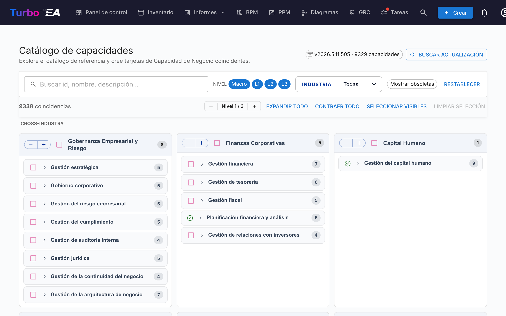

# Catálogo de capacidades

Turbo EA incluye el **[Business Capability Reference Catalogue](https://catalog.turbo-ea.org)** — un catálogo abierto y curado de capacidades de negocio mantenido en [github.com/vincentmakes/turbo-ea-capabilities](https://github.com/vincentmakes/turbo-ea-capabilities). La página Catálogo de capacidades le permite explorar este referencial y crear en masa las tarjetas `BusinessCapability` correspondientes, en lugar de teclearlas una a una.

## Abrir la página

Haga clic en el icono de usuario en la esquina superior derecha de la aplicación y, a continuación, en **Catálogo de capacidades**. La página está disponible para cualquier usuario con el permiso `inventory.view`.

## Lo que ve

- **Cabecera** — la versión activa del catálogo, el número de capacidades que contiene y (para administradores) los controles para comprobar y obtener actualizaciones.
- **Barra de filtros** — búsqueda en texto completo por id, nombre, descripción y alias, además de chips de nivel (Macro → L1 → L4), un selector múltiple de sector y un conmutador «Mostrar obsoletas». Permanece anclada justo debajo de la navegación superior mientras se desplaza la página.
- **Barra de acciones** — contadores de coincidencias, el selector global de nivel (despliega/colapsa todos los L1 un nivel a la vez), expandir/colapsar todo, seleccionar visibles, limpiar selección. Queda anclada junto a la barra de filtros para que los controles sigan al alcance incluso en lo profundo de un subárbol L1.
- **Cuadrícula de L1** — una tarjeta por capacidad de primer nivel, **agrupada bajo encabezados de sector**. Las capacidades **Cross-Industry** se fijan al inicio; los demás sectores siguen por orden alfabético; las capacidades sin etiqueta de sector caen al final en un bloque **General**. El nombre del L1 ocupa una banda de cabecera azul claro; las capacidades hijas se listan debajo, indentadas con un fino filete vertical para indicar la profundidad — la misma convención de jerarquía utilizada en el resto de la aplicación, para que la página no tenga una identidad visual propia. Los nombres largos se ajustan en varias líneas en lugar de truncarse. Cada cabecera de L1 expone también su propio selector `−` / `+`: `+` abre el siguiente nivel de descendientes solo para ese L1, `−` cierra el nivel abierto más profundo. Ambos botones siempre están visibles (la dirección no disponible queda deshabilitada), la acción está restringida a ese L1 — las demás ramas se mantienen — y el selector global de nivel en la parte superior de la página no se ve afectado.
- **Botón volver arriba** — en cuanto se desplaza más allá del encabezado, aparece una flecha flotante circular en la esquina inferior derecha. Al hacer clic, vuelve suavemente al inicio de la página. El botón se desplaza automáticamente hacia arriba cuando la barra anclada **Crear N capacidades** está activa, de modo que ambas nunca se solapan.

## Seleccionar capacidades

Marque la casilla situada junto a una capacidad para añadirla a la selección. La selección se propaga por el subárbol en ambas direcciones, pero nunca toca a los ancestros:

- **Marcar** una capacidad no seleccionada la añade a ella y a cada descendiente seleccionable.
- **Desmarcar** una capacidad seleccionada la elimina, junto con cada descendiente seleccionable.

Desmarcar un único hijo solo elimina ese hijo y lo que tenga debajo — el padre y los hermanos siguen seleccionados. Desmarcar un padre elimina todo el subárbol de una vez. Para componer una selección «L1 + algunas hojas», elija el L1 (esto activa todo el subárbol) y luego desmarque las capacidades L2/L3 que no desee — el L1 permanece seleccionado y su casilla sigue marcada.

La página adopta automáticamente el tema claro/oscuro de la aplicación — en modo oscuro se muestra el mismo diseño neutro sobre papel `#1e1e1e` con texto y acentos en color lavanda.

Las capacidades que **ya existen** en su inventario aparecen con un **icono de marca verde** en lugar de una casilla. No pueden seleccionarse — nunca podrá crear dos veces la misma Business Capability a través del catálogo. La detección prioriza la marca `attributes.catalogueId` dejada por una importación previa (de modo que la marca verde sobrevive a cambios del nombre visible) y recurre a una comparación del nombre visible insensible a mayúsculas/minúsculas para las tarjetas creadas a mano.

## Creación masiva de tarjetas

Cuando hay una o más capacidades seleccionadas, aparece un botón fijo en la parte inferior **Crear N capacidades**. Utiliza el permiso habitual `inventory.create` — si su rol no permite crear tarjetas, el botón queda deshabilitado.

Tras la confirmación, Turbo EA:

- Crea una tarjeta `BusinessCapability` por cada entrada del catálogo seleccionada.
- **Preserva automáticamente la jerarquía del catálogo** — cuando padre e hijo están ambos seleccionados (o el padre ya existe localmente), el `parent_id` de la nueva tarjeta hija se conecta a la tarjeta correcta.
- **Omite silenciosamente las coincidencias existentes**. El diálogo de resultado indica cuántas se crearon y cuántas se omitieron.
- Estampa los `attributes` de cada tarjeta nueva con `catalogueId`, `catalogueVersion`, `catalogueImportedAt` y `capabilityLevel` para que pueda rastrear su procedencia.

Volver a ejecutar la misma importación es seguro — es idempotente.

**Vinculación bidireccional.** La jerarquía se repara en ambas direcciones, así que el orden de importación no importa:

- Seleccionar solo un hijo cuyo **padre del catálogo ya existe** como tarjeta engancha automáticamente el nuevo hijo a ese padre existente.
- Seleccionar solo un padre cuyos **hijos del catálogo ya existen** como tarjetas re-asigna esos hijos bajo la nueva tarjeta — independientemente de su posición actual (de primer nivel o anidados a mano bajo otra tarjeta). En la importación, el catálogo es la fuente de verdad de la jerarquía; si prefiere un padre distinto para una tarjeta concreta, edítela después de la importación. El diálogo de resultado indica cuántas tarjetas se reasociaron, junto con los recuentos de creadas y omitidas.

## Capacidades Macro (Nivel 0)

Por encima de los niveles L1 / L2 / L3 / L4, el catálogo envía una capa **Macro** adicional — un pequeño conjunto de agrupaciones de nivel de negocio que enmarcan familias enteras de L1. Ejemplos incluyen *Customer Engagement* (enmarca los L1 de Ventas, Marketing, Servicio) o *Talent & Workforce* (enmarca los L1 de RR.HH.).

Las Macros son entradas de catálogo de primera clase:

- Aterrizan en tu inventario como tarjetas `BusinessCapability` con `attributes.capabilityLevel = "Macro"` y un `catalogueId` prefijado `MC-` (p.ej. `MC-10`).
- Se sitúan **por encima** de sus hijos L1 — el límite de profundidad de jerarquía se relaja de 5 a 6 para acomodar la capa extra (`Macro → L1 → L2 → L3 → L4 → L5`).
- Cuando importas una Macro, cualquier hijo L1 existente marcado como perteneciente a esa Macro es re-parentado automáticamente bajo la nueva tarjeta — la misma vinculación bidireccional que aplica entre L1 y niveles inferiores.
- **Las Macros nunca coinciden con tarjetas existentes por nombre** — solo por `catalogueId`. Esto evita colisiones accidentales con grupos de capacidades nombrados por el cliente que casualmente compartan etiqueta con una Macro del catálogo.

Las Macros son seleccionables desde la página del catálogo igual que los L1 — marca la casilla y el subárbol se selecciona en consecuencia.

## Vista de detalle

Haga clic en el nombre de cualquier capacidad para abrir un diálogo de detalle que muestra su miga de pan, descripción, sector, alias, referencias y una vista totalmente desplegada de su subárbol. Las coincidencias existentes en el subárbol se marcan con una marca verde.

## Actualizar el catálogo (administradores)

El catálogo se distribuye **empaquetado** como dependencia Python, por lo que la página funciona sin conexión / en despliegues aislados. Los administradores (`admin.metamodel`) pueden obtener una versión más reciente a demanda:

1. Pulse **Comprobar actualizaciones**. Turbo EA consulta la API JSON de PyPI en `https://pypi.org/pypi/turbo-ea-capabilities/json` e indica si hay una versión publicada más reciente disponible. PyPI es la fuente de verdad en el momento de la publicación, por lo que un wheel publicado hace unos minutos se detecta inmediatamente.
2. Si la hay, pulse el botón **Obtener v…** que aparece. Turbo EA descarga el wheel más reciente desde PyPI, extrae la carga útil del catálogo de su interior y la guarda como sustitución del lado del servidor; surte efecto inmediatamente para todos los usuarios.

La versión activa del catálogo siempre se muestra en la chip de cabecera. La sustitución solo prevalece sobre el paquete empaquetado cuando su versión es estrictamente mayor — así que una actualización de Turbo EA que envíe un catálogo empaquetado más reciente seguirá funcionando como se espera.

La URL del índice PyPI se puede configurar mediante la variable de entorno `CAPABILITY_CATALOGUE_PYPI_URL`, para despliegues aislados o réplicas privadas.
