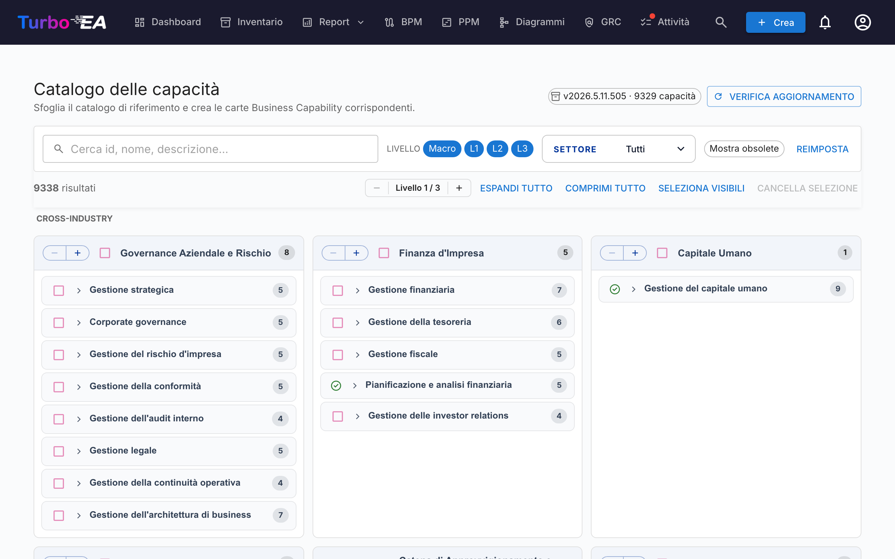

# Catalogo delle capacità

Turbo EA viene fornito con il **[Business Capability Reference Catalogue](https://catalog.turbo-ea.org)** — un catalogo aperto e curato di capacità di business mantenuto su [github.com/vincentmakes/turbo-ea-capabilities](https://github.com/vincentmakes/turbo-ea-capabilities). La pagina Catalogo delle capacità consente di consultare questo riferimento e di creare in blocco le carte `BusinessCapability` corrispondenti, invece di digitarle una per una.

## Aprire la pagina

Fare clic sull'icona dell'utente nell'angolo in alto a destra dell'app, quindi su **Catalogo delle capacità**. La pagina è disponibile per chiunque disponga del permesso `inventory.view`.

## Cosa si vede

- **Intestazione** — la versione attiva del catalogo, il numero di capacità contenute e (per gli amministratori) i controlli per verificare e ottenere gli aggiornamenti.
- **Barra dei filtri** — ricerca testuale completa su id, nome, descrizione e alias, oltre a chip di livello (Macro → L1 → L4), un selettore multiplo di settore e un interruttore «Mostra deprecate». Resta ancorata appena sotto la barra di navigazione superiore mentre si scorre la pagina.
- **Barra delle azioni** — contatori di corrispondenze, lo stepper globale di livello (apre/chiude tutti gli L1 di un livello alla volta), espandi/comprimi tutto, seleziona visibili, pulisci selezione. Resta ancorata accanto alla barra dei filtri così i controlli rimangono raggiungibili anche in profondità all'interno di un sottoalbero L1.
- **Griglia di L1** — una carta per ogni capacità di primo livello, **raggruppata sotto intestazioni di settore**. Le capacità **Cross-Industry** sono fissate in cima; gli altri settori seguono in ordine alfabetico; le capacità senza etichetta di settore finiscono in fondo in un blocco **Generale**. Il nome dell'L1 è inserito in una fascia di intestazione blu chiaro; le capacità figlie sono elencate sotto, indentate con una sottile linea verticale per indicare la profondità — la stessa convenzione gerarchica usata nel resto dell'app, in modo che la pagina non porti un'identità visiva propria. I nomi lunghi vanno a capo su più righe invece di essere troncati. Ogni intestazione di L1 espone inoltre il proprio stepper `−` / `+`: `+` apre il livello successivo dei discendenti solo per quell'L1, `−` chiude il livello aperto più profondo. Entrambi i pulsanti sono sempre visibili (la direzione non disponibile è disabilitata), l'azione è limitata a quel singolo L1 — gli altri rami restano fermi — e lo stepper globale in cima alla pagina non viene influenzato.
- **Pulsante torna su** — non appena si scorre oltre l'intestazione, in basso a destra appare una freccia circolare flottante. Un clic riporta dolcemente in cima alla pagina. Il pulsante si sposta automaticamente verso l'alto quando la barra ancorata **Crea N capacità** è attiva, così le due non si sovrappongono mai.

## Selezionare le capacità

Selezionare la casella accanto a una capacità per aggiungerla alla selezione. La selezione si propaga lungo il sottoalbero in entrambe le direzioni ma non tocca mai gli antenati:

- **Spuntare** una capacità non selezionata aggiunge essa e ogni discendente selezionabile.
- **Deselezionare** una capacità selezionata rimuove essa e ogni discendente selezionabile.

Deselezionare un singolo figlio rimuove quindi soltanto quel figlio e ciò che sta sotto — il genitore e i fratelli restano selezionati. Deselezionare un genitore rimuove l'intero sottoalbero in un colpo solo. Per ottenere una selezione «L1 + qualche foglia», scegliere l'L1 (questo seleziona l'intero sottoalbero) e poi deselezionare le capacità L2/L3 che non si vogliono — l'L1 resta selezionato e la sua casella resta spuntata.

La pagina adotta automaticamente il tema chiaro/scuro dell'app — in modalità scura viene reso lo stesso layout neutro su carta `#1e1e1e` con testo e accenti color lavanda.

Le capacità che **esistono già** nel proprio inventario appaiono con un'**icona di spunta verde** invece di una casella. Non possono essere selezionate — non si potrà mai creare due volte la stessa Business Capability tramite il catalogo. La corrispondenza preferisce il marcatore `attributes.catalogueId` lasciato da un'importazione precedente (così la spunta verde sopravvive alle modifiche del nome visualizzato) e ricade su un confronto del nome visualizzato insensibile alle maiuscole per le carte create a mano.

## Creazione massiva delle carte

Quando una o più capacità sono selezionate, in fondo alla pagina compare un pulsante fisso **Crea N capacità**. Usa il permesso ordinario `inventory.create` — se il proprio ruolo non consente la creazione di carte, il pulsante è disabilitato.

Alla conferma, Turbo EA:

- Crea una carta `BusinessCapability` per ogni voce del catalogo selezionata.
- **Preserva automaticamente la gerarchia del catalogo** — quando sia il genitore sia il figlio sono selezionati (oppure il genitore esiste già localmente), il `parent_id` della nuova carta figlio è collegato alla carta corretta.
- **Salta in silenzio le corrispondenze esistenti**. La finestra di risultato mostra quante carte sono state create e quante saltate.
- Marca gli `attributes` di ogni nuova carta con `catalogueId`, `catalogueVersion`, `catalogueImportedAt` e `capabilityLevel`, in modo da poter risalire alla loro origine.

Eseguire di nuovo la stessa importazione è sicuro — è idempotente.

**Collegamento bidirezionale.** La gerarchia viene riparata in entrambe le direzioni, quindi l'ordine di importazione non conta:

- Selezionando solo un figlio il cui **genitore di catalogo esiste già** come carta, il nuovo figlio viene innestato automaticamente sotto quel genitore esistente.
- Selezionando solo un genitore i cui **figli di catalogo esistono già** come carte, quei figli vengono ri-collegati sotto la nuova carta — indipendentemente da dove si trovino al momento (al primo livello o annidati a mano sotto un'altra carta). In fase di importazione il catalogo fa fede sulla gerarchia; se si preferisce un genitore diverso per una carta specifica, modificarla dopo l'importazione. La finestra di risultato indica quante carte sono state ri-collegate accanto ai conteggi di create e saltate.

## Capacità Macro (Livello 0)

Sopra i livelli L1 / L2 / L3 / L4, il catalogo fornisce un livello **Macro** aggiuntivo — un piccolo set di raggruppamenti di livello business che inquadrano intere famiglie L1. Esempi includono *Customer Engagement* (inquadra gli L1 Sales, Marketing, Service) o *Talent & Workforce* (inquadra gli L1 HR).

Le Macro sono voci di catalogo di prima classe:

- Atterrano nel tuo inventario come card `BusinessCapability` con `attributes.capabilityLevel = "Macro"` e un `catalogueId` con prefisso `MC-` (ad es. `MC-10`).
- Si trovano **sopra** i loro figli L1 — il limite di profondità della gerarchia si rilassa da 5 a 6 per accogliere il livello aggiuntivo (`Macro → L1 → L2 → L3 → L4 → L5`).
- Quando importi una Macro, qualsiasi figlio L1 esistente segnato come appartenente a quella Macro viene automaticamente ri-padronato sotto la nuova card — lo stesso collegamento bidirezionale che si applica tra L1 e i livelli inferiori.
- **Le Macro non corrispondono mai a card esistenti per nome** — solo per `catalogueId`. Questo evita collisioni accidentali con gruppi di capacità nominati dal cliente che condividano per caso un'etichetta con una Macro del catalogo.

Le Macro sono selezionabili dalla pagina del catalogo proprio come gli L1 — spunta la casella e il sottoalbero viene selezionato di conseguenza.

## Vista di dettaglio

Fare clic sul nome di una capacità per aprire una finestra di dettaglio che mostra la breadcrumb, la descrizione, il settore, gli alias, i riferimenti e una vista completamente espansa del suo sottoalbero. Le corrispondenze esistenti nel sottoalbero sono evidenziate con una spunta verde.

## Aggiornare il catalogo (amministratori)

Il catalogo è distribuito **incluso** come dipendenza Python, quindi la pagina funziona offline / in deployment isolati. Gli amministratori (`admin.metamodel`) possono ottenere una versione più recente su richiesta:

1. Fare clic su **Verifica aggiornamenti**. Turbo EA interroga l'API JSON di PyPI all'indirizzo `https://pypi.org/pypi/turbo-ea-capabilities/json` e segnala se è disponibile una versione pubblicata più recente. PyPI è la fonte di verità al momento della pubblicazione, quindi un wheel pubblicato pochi minuti fa viene rilevato immediatamente.
2. In caso affermativo, fare clic sul pulsante **Ottieni v…** che appare. Turbo EA scarica il wheel più recente da PyPI, ne estrae il payload del catalogo e lo memorizza come override lato server; ha effetto immediato per tutti gli utenti.

La versione attiva del catalogo è sempre indicata nel chip di intestazione. L'override prevale sul pacchetto incluso solo quando la sua versione è strettamente maggiore — così un aggiornamento di Turbo EA che fornisce un catalogo incluso più recente continuerà a funzionare come previsto.

L'URL dell'indice PyPI è configurabile tramite la variabile d'ambiente `CAPABILITY_CATALOGUE_PYPI_URL`, per deployment isolati o mirror privati.
